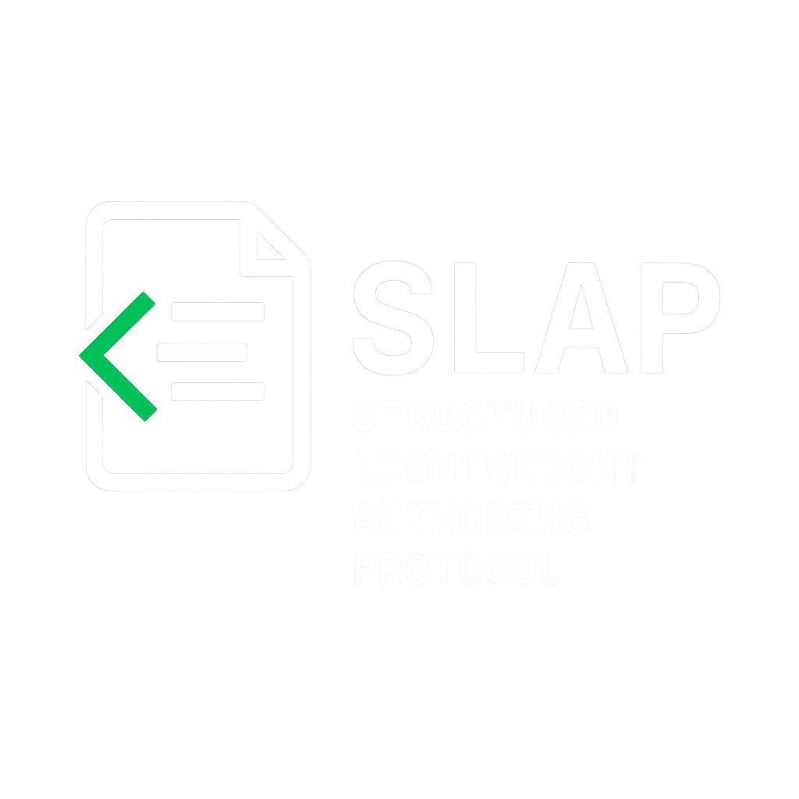

<p align="center">
  
</p>

<p align="center"><strong>Finally, a spec that won’t make your parser cry.</strong></p>

<p align="center">
  <em>Version 1.2 — 2025-04-10</em>
</p>

---

## 🚀 Overview

**SLAP** is a minimalist markup language engineered for *clarity, structure, and sanity*. It was born from the ashes of Compact Structured Markup (CSM) and redesigned with fewer tokens, stronger annotations, and cleaner multi-line formatting. Whether you’re feeding it to an AI or writing it by hand, SLAP is designed to be lean, readable, and *parser-friendly*.

## ✨ Key Features

- **📐 Minimal Syntax, Maximum Structure**  
  Reserved tokens and indentation define everything. No clutter. No chaos. Just structure.

- **⚡ Token-Efficient by Design**  
  Keep it lightweight for large-scale AI processing or compact documentation pipelines.

- **🧠 Smarter Inline Annotations**  
  Use `[note: …]` or `(note: …)` for seamless inline metadata.  
  ```slap
  text: This is a sentence [note: do not delete the database again].
  ```

- **📖 Multi-Line Text Blocks (finally)**  
  Natural paragraph flow using custom delimiters:  
  ```slap
  text:
    >>>
    This is a long paragraph spanning multiple lines.
    It allows for more natural narrative flow.
    <<<
  ```

- **🛡️ Robust Error Recovery**  
  Syntax errors? No problem. SLAP parsers log the issue and carry on like champs.

- **🧩 Extensible by Default**  
  Want to add tables, citations, or weird alien formats? Use custom directives like `x-table:` and SLAP won’t even flinch.

---

## 📚 Specification

The full SLAP specification lives in [`SPECIFICATION.md`](SPECIFICATION.md), including:

- Design philosophy & syntax rules
- Core token definitions (`meta`, `header`, `text`, `list`, `code`)
- Enhancements: inline annotations, block delimiters, custom extensions
- Parsing strategy, rendering formats, and resilience requirements
- Implementation guidance (including parser tooling, CLI options, and test strategies)

---

## 🧰 Getting Started

### Installation

```bash
git clone https://github.com/your-username/structured-lightweight-authoring-protocol.git
cd structured-lightweight-authoring-protocol
```

### Basic Usage

1. **Write SLAP Docs:**  
   Create `.slap` files and structure them using the spec.

2. **Parse & Render:**  
   Use the parser tools in `/parsers` (Python, JavaScript, etc.) to process `.slap` files into readable or rendered output.

3. **Extend It:**  
   Build custom directives. Submit improvements. Get a SLAP tattoo. Your journey begins here.

---

## 🙌 Contributing

We welcome your ideas, bugs, pull requests, memes, and markdown regrets:

- Open an [issue](https://github.com/your-username/structured-lightweight-authoring-protocol/issues)
- Submit a PR with focused, atomic changes
- Add to `/parsers` or enhance the spec with backward-compatible updates

---

## 📄 License

This project is licensed under the BSD 3-Clause.  
See [`LICENSE`](LICENSE) for the full legal spell scroll.

---

> SLAP: For people who think Markdown is too soft.
